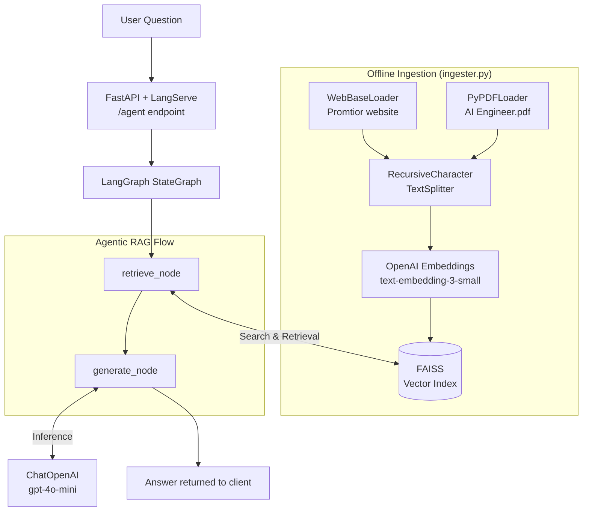

# Technical Report: Promtior Bionic Agent

## 1. Project Overview

This solution implements a **Bionic RAG Agent** designed to represent Promtior's identity. Using an agentic approach with **LangGraph**, the system reasons through a structured workflow to provide accurate, grounded information about the company's founders, services, and capabilities.

### Data Sources

| Source | Loader | Purpose |
|---|---|---|
| `https://promtior.ai/` | `WebBaseLoader` | Live company information |
| `data/AI Engineer.pdf` | `PyPDFLoader` | Supplementary technical context |

Both sources are chunked and combined into a single **FAISS** vector index.

## 2. Implementation Logic

* **Orchestration:** Used **LangGraph** `StateGraph` to manage a typed state (`question → context → answer`) through discrete nodes, enabling future self-correction cycles.
* **Grounding:** Implemented a **System Prompt Guardrail** containing verified facts (May 2023, Emiliano Chinelli, Ignacio Acuña) that the LLM must prefer over raw retrieved context.
* **Vector Store:** Utilized **FAISS** (`faiss-cpu`) for high-performance similarity search with **OpenAI `text-embedding-3-small`** embeddings.
* **API:** Exposed via **LangServe** on FastAPI, providing auto-generated docs at `/agent/playground`.

## 3. Main Challenges & Solutions

| Challenge | Solution |
|---|---|
| Initial retrieval missed the founders' names | Increased `k=5` and added a layered prompt that prioritizes verified facts |
| Web content had noisy HTML | Used `RecursiveCharacterTextSplitter` with overlap to preserve paragraph context |
| Railway deployment port conflicts | `CMD` reads `$PORT` env var with fallback to `8000` |
| LangServe validation errors on input schema | Split `AgentState` into `InputState` / `OutputState` for proper JSON schema generation |

## 4. Component Diagram

