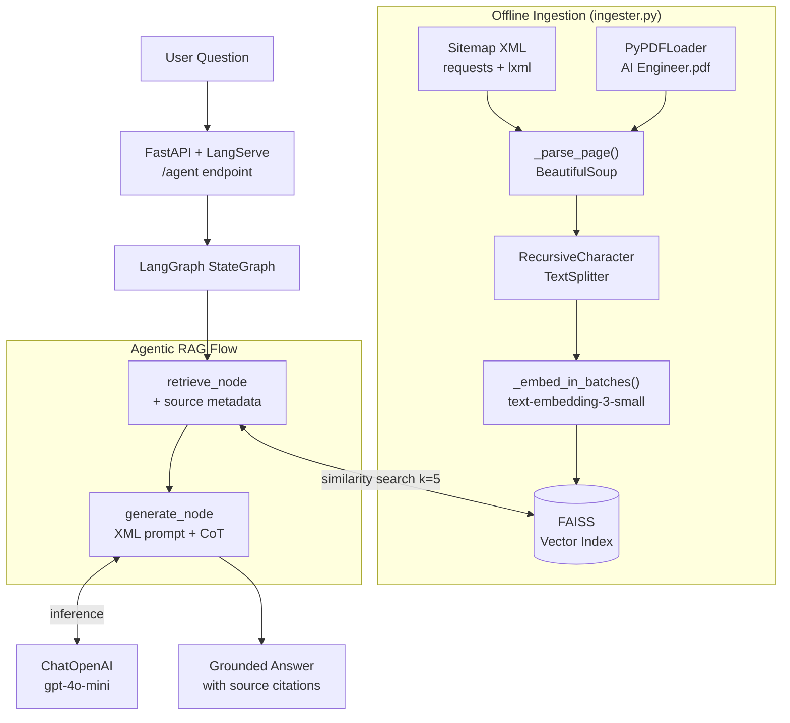

# Technical Report: Promtior Bionic Agent

## 1. Project Overview

This solution implements a **Bionic RAG Agent** designed to represent Promtior's identity. Using an agentic approach with **LangGraph**, the system reasons through a structured workflow to provide accurate, grounded information about the company's founders, services, and capabilities.

### Data Sources

| Source | Loader | Purpose |
|---|---|---|
| `pages-sitemap.xml` (16 URLs) | `requests` + `BeautifulSoup` | All main pages: home, services, use-cases, ebook, etc. |
| `blog-posts-sitemap.xml` (10 URLs) | `requests` + `BeautifulSoup` | All blog posts: AI guides, case reflections, tech articles |
| `data/AI Engineer.pdf` | `PyPDFLoader` | Challenge presentation (extra points) |

All sources are parsed with a custom `_parse_page()` function that strips `<nav>`, `<footer>`, `<script>`, then chunked and combined into a single **FAISS** vector index.

### Design Patterns

* **Factory Pattern:** `@lru_cache` singletons in `config.py` for LLM, Embeddings, and Retriever -- created once, reused across all requests.
* **Strategy Pattern:** `ingester.py` uses separate loader functions (`_load_sitemap`, `_load_pdf`) with a common `list[Document]` return type, making it easy to add new data sources.

## 2. Implementation Logic

* **Orchestration:** Used **LangGraph** `StateGraph` with typed state (`question -> context -> sources -> answer`) and separate `InputState` / `OutputState` schemas for clean LangServe serialization.
* **Grounding:** Implemented an **XML-tagged System Prompt** with `<verified_facts>` and `<instructions>` blocks. The prompt uses **Chain-of-Thought** (silent reasoning) and explicitly instructs the LLM to synthesize available information rather than refuse.
* **Source Citation:** The `retrieve_node` tags each chunk with its `source_type` (website / presentation), enabling the `generate_node` to cite origins in answers.
* **Content Cleaning:** A custom `_parse_page()` BeautifulSoup function decomposes `<nav>`, `<footer>`, `<script>` tags and extracts text from `<main>` or `<article>`, eliminating HTML noise at the source.
* **Data Safeguards:** Static asset URLs (`.jpg`, `.png`, `.svg`, etc.) are rejected before fetching. Content-Type is validated as `text/html`. Pages with fewer than 200 characters of clean text are discarded. Embeddings are sent in batches to avoid OpenAI 429 rate limits.
* **Vector Store:** Utilized **FAISS** (`faiss-cpu`) for similarity search with **OpenAI `text-embedding-3-small`** embeddings and `k=5`.
* **API:** Exposed via **LangServe** on FastAPI, providing a playground at `/agent/playground`.

## 3. Main Challenges & Solutions

| Challenge | Solution |
|---|---|
| Initial retrieval missed the founders' names | Increased `k=5` and added verified facts in the system prompt as fallback |
| Web content had noisy HTML (nav bars, footers) | Custom `_parse_page()` with BeautifulSoup decomposes nav/footer/script/iframe/svg tags |
| Single-URL scraping missed blog posts and subpages | Switched to sitemap-based deep crawl (`pages-sitemap.xml` + `blog-posts-sitemap.xml`) covering 26 URLs |
| LLM answered "I don't have enough information" despite having context | Rewrote system prompt with XML tags and explicit instruction: "If ANY relevant info exists, YOU MUST answer" |
| LangServe required all state fields in input | Split `AgentState` into `InputState` / `OutputState` for proper JSON schema generation |
| `typing.TypedDict` incompatible with Pydantic on Python < 3.12 | Changed import to `typing_extensions.TypedDict` |
| Railway deployment port conflicts | `CMD` reads `$PORT` env var with fallback to `8000` |
| Static assets (.jpg, .png) polluting vector store | Added `_is_static_asset()` filter + Content-Type validation + 200-char minimum |
| OpenAI 429 rate limits during embedding | Implemented `_embed_in_batches()` with 50-doc batches and 1s pause |

## 4. Component Diagram

